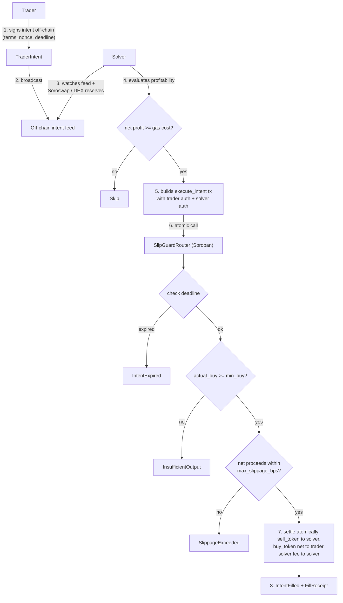

# SlipGuard

**Intent-based conditional orders with enforced slippage protection, built natively for Stellar and Soroban.**

[](./LICENSE)
[](https://stellar.org)
[](https://crates.io/crates/soroban-sdk)
[](https://github.com/SlipGuard-HQ/stellar-slipguard/actions/workflows/ci.yml)
[](./pnpm-workspace.yaml)

SlipGuard lets a trader express an order as a signed, off-chain **intent** ("sell exactly this much XLM, and I will not accept less than this much USDC, and I will not wait past this deadline") and lets any solver fill it on chain. The router is the only component that moves funds, it is non-custodial, and it reverts any fill that breaks the trader's stated terms.

---

## The problem

A market order does not tell you the price you will get. On AMMs, the price is a function of the pool state at the moment your transaction lands: any pending order is an invitation to be sandwiched by a searcher who buys ahead of you, lets you move the pool, and sells behind you. Slippage limits are a damage cap, not a protection: they let you get filled at the worst price you said you would tolerate, and nothing better.

Limit orders fix the price but not the execution. On a 5-second ledger, a resting order needs a keeper to notice it and submit a fill, and that keeper needs a reason to act. SlipGuard makes the keeper's incentive explicit and puts the trader's constraints in the execution path itself, so a fill that does not meet them cannot settle.

## How it works



The trader's funds never leave their wallet until a fill succeeds, and the pull only happens under the trader's own signature. There is no escrow account, and no ERC-20 style allowance to manage.

## Why Stellar and Soroban

- **The fee ceiling is not the constraint.** Stellar's base fee is 100 stroops (0.00001 XLM) per operation, and Soroban adds a resource fee that is priced per unit of CPU and I/O actually used. A working solver does not have to net a large spread before a fill is worth submitting, which is what makes small conditional orders viable instead of gas-dominated.
- **Five-second ledgers make a resting intent useful.** A deadline measured in seconds is meaningful when the chain closes a ledger roughly every five seconds. Off-chain intents with on-chain enforcement only make sense when the gap between signing and settling is short.
- **Soroban's auth model is the mechanism, not a detail.** `Address::require_auth()` is checked inside the contract, so `execute_intent` can require *both* the solver and the trader to authorize the exact argument set. The trader is not trusting the solver with a blank cheque: the signature binds the tokens, amounts, deadline and nonce. The trader can hand a pre-signed authorization entry to any solver without giving up control of the fill price.
- **SEP-41 tokens are composable.** The router calls the standard token interface, so it works with the Stellar Asset Contract for XLM and any issued asset, plus any SEP-41 token deployed on Soroban.

## Repository layout

```
slipguard/
├── contracts/
│   ├── router/            # SlipGuardRouter: hashing, cancellation, settlement
│   └── mock_token/        # SEP-41 token used by the test suite
├── packages/
│   ├── sdk/               # @slipguard/sdk: build, hash and submit intents
│   └── solver-bot/        # @slipguard/solver-bot: reference keeper daemon
├── scripts/
│   ├── deploy.sh               # deploy + initialize in dependency order
│   └── create-wave-issues.sh   # create the Wave issue backlog in one run
├── docs/                  # protocol, end-user and developer documentation
├── .github/               # CI, lint workflow, issue and PR templates
├── Cargo.toml             # Rust workspace
├── pnpm-workspace.yaml    # pnpm workspace
└── package.json           # root scripts
```

## Quickstart

Requires Rust (stable, with the `wasm32v1-none` target), Node 20 or newer, and pnpm 12.

```bash
git clone https://github.com/SlipGuard-HQ/stellar-slipguard.git
cd slipguard

# Rust toolchain and WASM target (rust-toolchain.toml pins these)
rustup target add wasm32v1-none

# JavaScript dependencies
pnpm install

# Run everything
pnpm test
```

Individual pieces:

```bash
cargo test --all                             # contract unit tests
cargo build --target wasm32v1-none --release # release WASM artifacts

pnpm build:packages                          # compile both TypeScript packages
pnpm test:packages                           # SDK and solver bot tests
pnpm lint                                    # builds, typechecks, prettier, clippy
pnpm format                                  # rewrite files with Prettier
```

The compiled contracts land in `target/wasm32v1-none/release/`:

- `slipguard_router.wasm`
- `slipguard_mock_token.wasm`

## Documentation

| Page | Contents |
| --- | --- |
| [Introduction](./docs/01-introduction.md) | The problem, the intent model, and why Soroban's auth model is load-bearing. |
| [Protocol mechanics](./docs/02-protocol-mechanics.md) | Intent lifecycle, settlement order, and the fee and slippage math with worked numbers. |
| [End-user guides](./docs/03-end-user-guides.md) | How to trade with an intent, and how to run a solver profitably. |
| [Developer guide](./docs/04-developer-guide.md) | Setup, SDK reference, the RPC call pattern, configuration and deployment. |

## Deploying

`scripts/deploy.sh` deploys the router, initializes it, then deploys demo SEP-41
tokens, and prints a copy-pasteable summary of every contract id. It writes the
resolved ids to `.deploy/contracts.<network>.env` for the app layer.

```bash
pnpm build:contracts
DRY_RUN=true ./scripts/deploy.sh      # print the plan, touch nothing
./scripts/deploy.sh                   # deploy to testnet
NETWORK=mainnet DEPLOY_MOCK_TOKENS=false ./scripts/deploy.sh
```

## Wave issue backlog

`scripts/create-wave-issues.sh` creates the labels and the full issue backlog
with the `gh` CLI, each issue carrying a summary, scoped acceptance criteria and
a tech stack line.

```bash
DRY_RUN=true ./scripts/create-wave-issues.sh
./scripts/create-wave-issues.sh
```

## Contract reference

`SlipGuardRouter` is the settlement layer. Every function below is a Soroban entry point.

| Function | Authorization | Returns | Purpose |
| --- | --- | --- | --- |
| `init(admin)` | `admin.require_auth()` | `Result<(), SlipGuardError>` | One-time protocol setup. Reverts with `AlreadyInitialized` on a second call. |
| `get_intent_hash(intent)` | none | `BytesN<32>` | SHA-256 over the intent's canonical `ScVal` XDR encoding. |
| `cancel_intent(intent)` | `intent.trader.require_auth()` | `Result<(), SlipGuardError>` | Withdraw an active intent. Consumes the nonce so it can never fill. |
| `execute_intent(solver, intent, actual_buy_amount)` | `solver.require_auth()` **and** `intent.trader.require_auth()` | `Result<FillReceipt, SlipGuardError>` | Settle the order atomically. |
| `get_intent_status(intent_hash)` | none | `IntentStatus` | `Active`, `Filled` or `Cancelled`. See the note below. |
| `get_fill_receipt(intent_hash)` | none | `Option<FillReceipt>` | Settlement proof for a filled intent. |
| `is_nonce_used(trader, nonce)` | none | `bool` | Whether a `(trader, nonce)` pair has been consumed. |
| `get_admin()` | none | `Option<Address>` | The admin set by `init`. |

### Intent fields

| Field | Type | Meaning |
| --- | --- | --- |
| `trader` | `Address` | The account selling `sell_token`. |
| `sell_token` | `Address` | Token pulled from the trader on fill. |
| `buy_token` | `Address` | Token the solver must deliver. |
| `sell_amount` | `i128` | Exact `sell_token` amount moved to the solver. |
| `min_buy_amount` | `i128` | Gross `buy_token` amount the solver must deliver. |
| `max_slippage_bps` | `u32` | Maximum shortfall, in basis points, between `min_buy_amount` and the trader's net proceeds. |
| `deadline` | `u64` | Unix seconds after which the intent cannot fill. |
| `nonce` | `u64` | Per-trader single-use replay guard. |
| `solver_fee_bps` | `u32` | Fee, in basis points of the fill, retained by the solver. |

`IntentStatus::Expired` is defined so the enum is complete, but it is never written to storage: expiry is a function of the clock, not of the intent, and it is enforced by the deadline check inside `execute_intent`. An intent whose deadline has passed but which was never filled or cancelled still reads `Active`.

### Errors

| Code | Name | Raised when |
| --- | --- | --- |
| 1 | `IntentExpired` | `ledger().timestamp() > deadline`. |
| 2 | `InsufficientOutput` | `actual_buy_amount < min_buy_amount`. |
| 3 | `SlippageExceeded` | The trader's net proceeds fall further below `min_buy_amount` than `max_slippage_bps` allows. |
| 4 | `UnauthorizedTrader` | The solver is also the intent's trader. |
| 5 | `NonceAlreadyUsed` | The `(trader, nonce)` pair has already been consumed. |
| 6 | `IntentNotActive` | The intent is `Filled` or `Cancelled`. |
| 7 | `MathOverflow` | A checked arithmetic operation overflowed. |
| 8 | `InvalidSlippageBps` | A basis-point value exceeds 10,000. |
| 9 | `InvalidAmount` | `sell_amount` or `min_buy_amount` is not strictly positive. |
| 10 | `AlreadyInitialized` | `init` was called twice. |

### Settlement order and safety

`execute_intent` follows checks-effects-interactions: intent status and the nonce are written **before** any token transfer, so a hostile token contract cannot re-enter and fill the same order twice. Every arithmetic operation is checked, all fee math is integer basis points with `i128`, and the contract is `#![no_std]` with no floating point anywhere.

## Authorization model

A fill moves tokens in four steps, all in one transaction:

1. `sell_token`: `trader -> solver`, for `sell_amount`.
2. `buy_token`: `solver -> router`, for `actual_buy_amount`.
3. `buy_token`: `router -> trader`, for `actual_buy_amount - solver_fee`.
4. `buy_token`: `router -> solver`, for `solver_fee`, when the fee is non-zero.

Steps 1 and 2 are authorized by the trader and the solver respectively. Steps 3 and 4 are authorized by the router itself, which is the contract making the call. The trader's authorization is scoped to the exact `execute_intent` invocation. The tokens, amounts, deadline and nonce are all part of the signed payload, so handing a pre-signed authorization entry to an untrusted solver does not let that solver change the terms.

## Using the SDK

```ts
import { IntentBuilder, SlipGuardClient, hashIntent, NETWORKS } from "@slipguard/sdk";

const intent = new IntentBuilder()
  .setTrader(traderPublicKey)
  .setPair(xlmContractId, usdcContractId)
  .setAmounts(100_000_000n, 95_000_000n) // sell 10 XLM, accept at least 9.5 USDC
  .setSlippageBps(50) // tolerate 0.50% of the minimum after fees
  .setSolverFeeBps(10) // solver keeps 0.10% of the fill
  .setDeadline(600) // valid for 10 minutes
  .setNonce(1n)
  .build();

// Off-chain hash, byte-for-byte identical to SlipGuardRouter::get_intent_hash
console.log(hashIntent(intent));

const client = new SlipGuardClient({
  contractId: "C...",
  ...NETWORKS.testnet,
  publicKey: traderPublicKey,
});

const onChainHash = await client.getIntentHash(intent);
const status = await client.getIntentStatus(intent);
```

The SDK is strict by default: addresses are validated as Stellar strkeys, amounts must be positive integers, basis points must be within `[0, 10000]`, and a deadline in the past is rejected at build time.

## Running the solver bot

The reference solver watches an intent feed and router events, checks that a fill is both valid under the contract's rules and profitable after gas, then submits the transaction and polls for inclusion.

```bash
cp .env.example .env
# set ROUTER_CONTRACT_ID and SOLVER_SECRET_KEY
DRY_RUN=true pnpm --filter @slipguard/solver-bot start
```

Set `DRY_RUN=false` once you have confirmed the bot is reading real intents. The daemon logs one JSON object per line and shuts down cleanly on `SIGINT` or `SIGTERM`.

## Security

The contracts are unaudited and have not been deployed to Stellar mainnet. Do not commit real keys, and do not point the solver at a mainnet contract with a funded account until the code has been reviewed. See [SECURITY.md](./SECURITY.md) for the disclosure process.

## Maintainers

| Maintainer | Role | Contact |
| --- | --- | --- |
| SlipGuard HQ | Protocol design, contracts, tooling | [@SlipGuard-HQ](https://github.com/SlipGuard-HQ) |

## Contributing

Read [CONTRIBUTING.md](./CONTRIBUTING.md) before opening a pull request. Every PR should reference an issue, pass CI, and include tests for new behaviour.

## License

[MIT](./LICENSE)

## Contributors

<a href="https://github.com/SlipGuard-HQ/stellar-slipguard/graphs/contributors">
  
</a>
