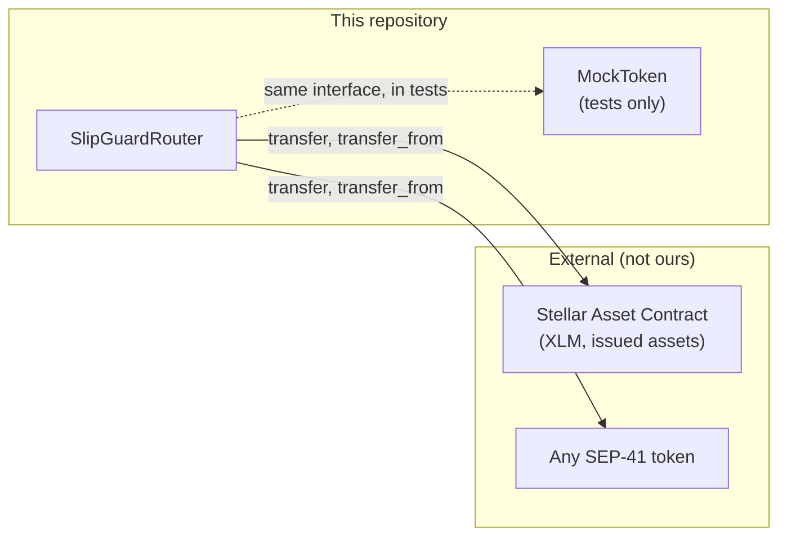

# 5. Contract architecture

This is the written specification the contracts were built from, checked against
the code in `contracts/`. Every function listed here maps to a step in a real
user flow. Nothing is included "just in case".

## Contracts and single responsibilities

Two crates. One owns settlement. The other exists only so the test suite can
exercise settlement against a real SEP-41 token.

| Crate | Contract | Owns | Does not own |
| --- | --- | --- | --- |
| `contracts/router` | `SlipGuardRouter` | Intent hashing, intent lifecycle, nonce consumption, authorization requirements, atomic settlement, fill receipts | Pricing, liquidity, matching, custody |
| `contracts/mock_token` | `MockToken` | A minimal SEP-41 token: metadata, balances, allowances, burning, admin minting | Anything protocol-specific |

`MockToken` is test infrastructure. It is never intended for deployment as a
real asset, and it holds no protocol logic.

## Dependency graph

The router calls SEP-41 tokens. It does not call the mock token specifically, and
the mock token does not know the router exists.

Because the router depends only on the SEP-41 interface, it works with the
Stellar Asset Contract for XLM and any issued asset, plus any SEP-41 token on
Soroban, with no asset-specific code.

**Deployment order.** Tokens first if they are being created, then the router,
then `init`. The router's `init` is the only call that must happen before any
other router entry point, and it records the admin that later authorizes nothing
else in v0.1 except future upgrades. `scripts/deploy.sh` enforces this order.

## Storage

`contracts/router/src/storage.rs` defines one key enum and the TTL policy.

| Key | Storage | Value | Written by |
| --- | --- | --- | --- |
| `Admin` | instance | `Address` | `init` |
| `IntentStatus(BytesN<32>)` | persistent | `IntentStatus` | `execute_intent`, `cancel_intent` |
| `FillReceipt(BytesN<32>)` | persistent | `FillReceipt` | `execute_intent` |
| `UsedNonce(Address, u64)` | persistent | `bool` | `execute_intent`, `cancel_intent` |

Persistent entries are extended on every write: they are bumped once remaining
life drops below 30 days, out to 90 days. The admin lives in instance storage
because it is read on every settled transaction and should not be evictable
independently of the contract instance.

`get_intent_status` returns `Active` for a key that has never been written. That
is deliberate: an unstored intent has not been filled and has not been cancelled,
which is exactly what `Active` means.

`contracts/mock_token/src/lib.rs` uses the same split: instance storage for
`Admin`, `Decimals`, `Name` and `Symbol`, persistent storage for
`Balance(Address)` and `Allowance(Address, Address)`.

## Entry points

Every function is a Soroban entry point. Authorization is the `require_auth()`
call made inside the function, not a modifier.

### `SlipGuardRouter`

| Function | Parameters | Returns | Authorization | Events |
| --- | --- | --- | --- | --- |
| `init` | `admin: Address` | `Result<(), SlipGuardError>` | `admin.require_auth()` | `Initialized { admin }` |
| `get_intent_hash` | `intent: TraderIntent` | `BytesN<32>` | none (pure) | none |
| `cancel_intent` | `intent: TraderIntent` | `Result<(), SlipGuardError>` | `intent.trader.require_auth()` | `IntentCancelled { trader, intent_hash }` |
| `execute_intent` | `solver: Address`, `intent: TraderIntent`, `actual_buy_amount: i128` | `Result<FillReceipt, SlipGuardError>` | `solver.require_auth()` then `intent.trader.require_auth()` | `IntentFilled { trader, intent_hash, solver, trader_proceeds, solver_fee, timestamp }` |
| `get_intent_status` | `intent_hash: BytesN<32>` | `IntentStatus` | none | none |
| `get_fill_receipt` | `intent_hash: BytesN<32>` | `Option<FillReceipt>` | none | none |
| `is_nonce_used` | `trader: Address`, `nonce: u64` | `bool` | none | none |
| `get_admin` | none | `Option<Address>` | none | none |

The four read functions exist because the SDK, the solver bot and the tests all
need them. They are not speculative: `get_intent_status` gates a fill decision in
the solver bot, `get_fill_receipt` is how an integrator shows a completed trade,
`is_nonce_used` is how a trader checks whether an intent is still live, and
`get_admin` is how a deployment is verified after `init`.

### `MockToken` (test infrastructure)

| Function | Parameters | Returns | Authorization |
| --- | --- | --- | --- |
| `initialize` | `admin`, `decimals`, `name`, `symbol` | `()` | `admin.require_auth()` |
| `mint` | `to: Address`, `amount: i128` | `()` | `admin.require_auth()` |
| `admin` | none | `Address` | none |
| `allowance` | `from`, `spender` | `i128` | none |
| `approve` | `from`, `spender`, `amount`, `expiration_ledger` | `()` | `from.require_auth()` |
| `balance` | `id` | `i128` | none |
| `transfer` | `from`, `to: MuxedAddress`, `amount` | `()` | `from.require_auth()` |
| `transfer_from` | `spender`, `from`, `to`, `amount` | `()` | `spender.require_auth()` |
| `burn` | `from`, `amount` | `()` | `from.require_auth()` |
| `burn_from` | `spender`, `from`, `amount` | `()` | `spender.require_auth()` |
| `decimals`, `name`, `symbol` | none | `u32` / `String` / `String` | none |

## Function to user-flow mapping

Every function traces to a step a real user takes.

| User flow step | Function |
| --- | --- |
| Trader writes and signs an intent off-chain | `get_intent_hash` (the SDK reproduces this to key a cache or a feed) |
| Operator sets up the protocol once at deployment | `init` |
| Trader changes their mind before a fill | `cancel_intent` |
| Solver settles the order | `execute_intent` |
| Anyone checks whether an order is still live | `get_intent_status`, `is_nonce_used` |
| Trader or UI shows what they received | `get_fill_receipt` |
| Operator verifies a deployment | `get_admin` |
| Test suite needs a token to settle against | the whole `MockToken` surface |

## Deliberately absent

These are not omissions, they are scope decisions. Each one is an issue in the
backlog rather than a half-built feature.

| Not present | Why |
| --- | --- |
| On-chain order book | The intent is a signed message, not a stored order. Matching happens off-chain. |
| Price oracle | The router enforces the trader's own floor and tolerance. It never needs to know a market price. |
| Liquidity vault | The solver brings the other side. The router never holds inventory between calls. |
| Partial fills | One fill per intent in v0.1. Tracked as a high-tier issue. |
| Pause / circuit breaker | v0.1 has no admin power over settlement. Tracked as a medium-tier issue. |
| Upgrade entry point | Not in v0.1. Would need its own design and testing. |
| Protocol fee | Only the solver fee exists. A protocol fee would need a second basis-point field and its own accounting. |

Keeping the admin's power at zero over live settlement is intentional. In v0.1
the admin is recorded at initialization and otherwise has no effect on any fill,
which removes a class of "who can freeze my funds" questions from review.

## Related

- Error codes and the settlement order: [Protocol mechanics](./02-protocol-mechanics.md)
- Function reference for callers: [Developer guide](./04-developer-guide.md#contract-entry-points)
